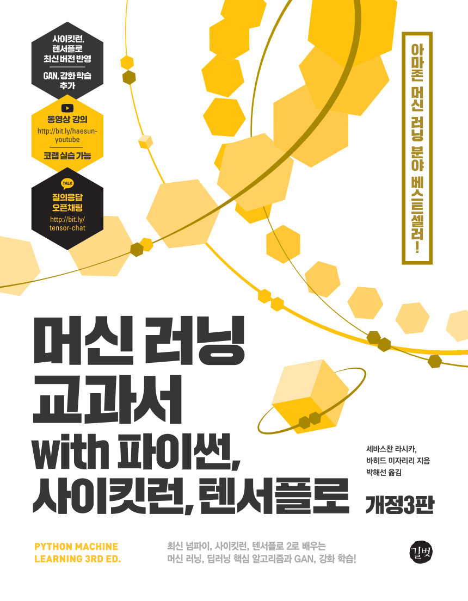

## 머신러닝 교과서 3판

2021년 3월 출간, 길벗 출판사

이 책은 세바스찬 라시카(Sebastian Raschka)와 바히드 미자리리(Vahid Mirjalili)이 쓴 아마존 베스트 셀러 "[Python Machine Learning: Machine Learning and Deep Learning with Python, scikit-learn, and TensorFlow 2, 3rd Edition](https://www.amazon.com/Python-Machine-Learning-scikit-learn-TensorFlow/dp/1789955750/)"의 번역서입니다.

번역서에 관한 궁금한 점이나 오류가 있다면 깃허브에 이슈를 남겨 주시거나 [블로그](http://bit.ly/2YGxYfQ)를 통해 알려 주세요.

머신러닝 교과서 1판의 깃허브 저장소는 다음과 같습니다(1판이 원서의 2판에 해당합니다).

- https://github.com/rickiepark/python-machine-learning-book-2nd-edition

## 목차와 주피터 노트북

**설치와 설정에 대한 도움말은 [1장의 README.md 파일](ch01/README.md)을 참고하세요.**

`open_dir` 링크를 클릭하면 각 장의 폴더로 이동합니다. 또는 `ipynb` 링크를 클릭해서 바로 주피터 노트북을 열어 볼 수 있습니다. `nbviewer`는 주피터의 노트북 뷰어로 볼 수 있는 링크입니다. `colab`은 구글 코랩(Colab)에서 노트북을 실행할 수 있는 링크입니다.

1. 컴퓨터는 데이터에서 배운다 [[open dir](./ch01)] [[ipynb](./ch01/ch01.ipynb)] [[nbviewer](https://nbviewer.jupyter.org/github/rickiepark/python-machine-learning-book-3rd-edition/blob/master/ch01/ch01.ipynb)] [[colab](https://colab.research.google.com/github/rickiepark/python-machine-learning-book-3rd-edition/blob/master/ch01/ch01.ipynb)]
2. 간단한 분류 알고리즘 훈련 [[open dir](./ch02)] [[ipynb](./ch02/ch02.ipynb)] [[nbviewer](https://nbviewer.jupyter.org/github/rickiepark/python-machine-learning-book-3rd-edition/blob/master/ch02/ch02.ipynb)] [[colab](https://colab.research.google.com/github/rickiepark/python-machine-learning-book-3rd-edition/blob/master/ch02/ch02.ipynb)]
3. 사이킷런을 타고 떠나는 머신 러닝 분류 모델 투어 [[open dir](./ch03)] [[ipynb](./ch03/ch03.ipynb)] [[nbviewer](https://nbviewer.jupyter.org/github/rickiepark/python-machine-learning-book-3rd-edition/blob/master/ch03/ch03.ipynb)] [[colab](https://colab.research.google.com/github/rickiepark/python-machine-learning-book-3rd-edition/blob/master/ch03/ch03.ipynb)]
4. 좋은 훈련 세트 만들기: 데이터 전처리 [[open dir](./ch04)] [[ipynb](./ch04/ch04.ipynb)] [[nbviewer](https://nbviewer.jupyter.org/github/rickiepark/python-machine-learning-book-3rd-edition/blob/master/ch04/ch04.ipynb)] [[colab](https://colab.research.google.com/github/rickiepark/python-machine-learning-book-3rd-edition/blob/master/ch04/ch04.ipynb)]
5. 차원 축소를 사용한 데이터 압축 [[open dir](./ch05)] [[ipynb](./ch05/ch05.ipynb)] [[nbviewer](https://nbviewer.jupyter.org/github/rickiepark/python-machine-learning-book-3rd-edition/blob/master/ch05/ch05.ipynb)] [[colab](https://colab.research.google.com/github/rickiepark/python-machine-learning-book-3rd-edition/blob/master/ch05/ch05.ipynb)]
6. 모델 평가와 하이퍼파라미터 튜닝의 모범 사례 [[open dir](./ch06)] [[ipynb](./ch06/ch06.ipynb)] [[nbviewer](https://nbviewer.jupyter.org/github/rickiepark/python-machine-learning-book-3rd-edition/blob/master/ch06/ch06.ipynb)] [[colab](https://colab.research.google.com/github/rickiepark/python-machine-learning-book-3rd-edition/blob/master/ch06/ch06.ipynb)]
7. 다양한 모델을 결합한 앙상블 학습 [[open dir](./ch07)] [[ipynb](./ch07/ch07.ipynb)] [[nbviewer](https://nbviewer.jupyter.org/github/rickiepark/python-machine-learning-book-3rd-edition/blob/master/ch07/ch07.ipynb)] [[colab](https://colab.research.google.com/github/rickiepark/python-machine-learning-book-3rd-edition/blob/master/ch07/ch07.ipynb)]
8. 감성 분석에 머신 러닝 적용하기 [[open dir](./ch08)] [[ipynb](./ch08/ch08.ipynb)] [[nbviewer](https://nbviewer.jupyter.org/github/rickiepark/python-machine-learning-book-3rd-edition/blob/master/ch08/ch08.ipynb)] [[colab](https://colab.research.google.com/github/rickiepark/python-machine-learning-book-3rd-edition/blob/master/ch08/ch08.ipynb)]
9. 웹 애플리케이션에 머신 러닝 모델 내장하기 [[open dir](./ch09)] [[ipynb](./ch09/ch09.ipynb)] [[nbviewer](https://nbviewer.jupyter.org/github/rickiepark/python-machine-learning-book-3rd-edition/blob/master/ch09/ch09.ipynb)] [[colab](https://colab.research.google.com/github/rickiepark/python-machine-learning-book-3rd-edition/blob/master/ch09/ch09.ipynb)]
10. 회귀 분석으로 연속적 타깃 변수 예측하기 [[open dir](./ch10)] [[ipynb](./ch10/ch10.ipynb)] [[nbviewer](https://nbviewer.jupyter.org/github/rickiepark/python-machine-learning-book-3rd-edition/blob/master/ch10/ch10.ipynb)] [[colab](https://colab.research.google.com/github/rickiepark/python-machine-learning-book-3rd-edition/blob/master/ch10/ch10.ipynb)]
11. 레이블되지 않은 데이터 다루기: 군집 분석 [[open dir](./ch11)] [[ipynb](./ch11/ch11.ipynb)] [[nbviewer](https://nbviewer.jupyter.org/github/rickiepark/python-machine-learning-book-3rd-edition/blob/master/ch11/ch11.ipynb)] [[colab](https://colab.research.google.com/github/rickiepark/python-machine-learning-book-3rd-edition/blob/master/ch11/ch11.ipynb)]
12. 다층 인공 신경망을 밑바닥부터 구현 [[open dir](./ch12)] [[ipynb](./ch12/ch12.ipynb)] [[nbviewer](https://nbviewer.jupyter.org/github/rickiepark/python-machine-learning-book-3rd-edition/blob/master/ch12/ch12.ipynb)] [[colab](https://colab.research.google.com/github/rickiepark/python-machine-learning-book-3rd-edition/blob/master/ch12/ch12.ipynb)]
13. 텐서플로를 사용한 신경망 훈련 [[open dir](./ch13)] [ipynb [part1](./ch13/ch13_part1.ipynb), [part2](./ch13/ch13_part2.ipynb)] [nbviewer [part1](https://nbviewer.jupyter.org/github/rickiepark/python-machine-learning-book-3rd-edition/blob/master/ch13/ch13_part1.ipynb), [part2](https://nbviewer.jupyter.org/github/rickiepark/python-machine-learning-book-3rd-edition/blob/master/ch13/ch13_part2.ipynb)] [colab [part1](https://colab.research.google.com/github/rickiepark/python-machine-learning-book-3rd-edition/blob/master/ch13/ch13_part1.ipynb), [part2](https://colab.research.google.com/github/rickiepark/python-machine-learning-book-3rd-edition/blob/master/ch13/ch13_part2.ipynb)]
14. 텐서플로의 구조 자세히 알아보기 [[open dir](./ch14)] [ipynb [part1](./ch14/ch14_part1.ipynb), [part2](./ch14/ch14_part2.ipynb), [part3](./ch14/ch14_part3.ipynb)]
[nbviewer [part1](https://nbviewer.jupyter.org/github/rickiepark/python-machine-learning-book-3rd-edition/blob/master/ch14/ch14_part1.ipynb), [part2](https://nbviewer.jupyter.org/github/rickiepark/python-machine-learning-book-3rd-edition/blob/master/ch14/ch14_part2.ipynb), [part3](https://nbviewer.jupyter.org/github/rickiepark/python-machine-learning-book-3rd-edition/blob/master/ch14/ch14_part3.ipynb)]
[colab [part1](https://colab.research.google.com/github/rickiepark/python-machine-learning-book-3rd-edition/blob/master/ch14/ch14_part1.ipynb), [part2](https://colab.research.google.com/github/rickiepark/python-machine-learning-book-3rd-edition/blob/master/ch14/ch14_part2.ipynb), [part3](https://colab.research.google.com/github/rickiepark/python-machine-learning-book-3rd-edition/blob/master/ch14/ch14_part3.ipynb)]
15. 심층 합성곱 신경망으로 이미지 분류 [[open dir](./ch15)] [ipynb [part1](./ch15/ch15_part1.ipynb), [part2](./ch15/ch15_part2.ipynb)]
[nbviewer [part1](https://nbviewer.jupyter.org/github/rickiepark/python-machine-learning-book-3rd-edition/blob/master/ch15/ch15_part1.ipynb), [part2](https://nbviewer.jupyter.org/github/rickiepark/python-machine-learning-book-3rd-edition/blob/master/ch15/ch15_part2.ipynb)]
[colab [part1](https://colab.research.google.com/github/rickiepark/python-machine-learning-book-3rd-edition/blob/master/ch15/ch15_part1.ipynb), [part2](https://colab.research.google.com/github/rickiepark/python-machine-learning-book-3rd-edition/blob/master/ch15/ch15_part2.ipynb)]
16. 순환 신경망으로 순차 데이터 모델링 [[open dir](./ch16)] [ipynb [part1](./ch16/ch16_part1.ipynb), [part2](./ch16/ch16_part2.ipynb)]
[nbviewer [part1](https://nbviewer.jupyter.org/github/rickiepark/python-machine-learning-book-3rd-edition/blob/master/ch16/ch16_part1.ipynb), [part2](https://nbviewer.jupyter.org/github/rickiepark/python-machine-learning-book-3rd-edition/blob/master/ch16/ch16_part2.ipynb)]
[colab [part1](https://colab.research.google.com/github/rickiepark/python-machine-learning-book-3rd-edition/blob/master/ch16/ch16_part1.ipynb), [part2](https://colab.research.google.com/github/rickiepark/python-machine-learning-book-3rd-edition/blob/master/ch16/ch16_part2.ipynb)]
17. 새로운 데이터 합성을 위한 생성적 적대 신경망 [[open dir](./ch17)] [ipynb [part1](./ch17/ch17_part1.ipynb), [part2](./ch17/ch17_part2.ipynb)]
[nbviewer [part1](https://nbviewer.jupyter.org/github/rickiepark/python-machine-learning-book-3rd-edition/blob/master/ch17/ch17_part1.ipynb), [part2](https://nbviewer.jupyter.org/github/rickiepark/python-machine-learning-book-3rd-edition/blob/master/ch17/ch17_part2.ipynb)]
[colab [part1](https://colab.research.google.com/github/rickiepark/python-machine-learning-book-3rd-edition/blob/master/ch17/ch17_part1.ipynb), [part2](https://colab.research.google.com/github/rickiepark/python-machine-learning-book-3rd-edition/blob/master/ch17/ch17_part2.ipynb)]
18. 강화 학습으로 복잡한 환경에서 의사 결정하기 [[open dir](./ch18)] [[ipynb](./ch18/ch18.ipynb)] [[nbviewer](https://nbviewer.jupyter.org/github/rickiepark/python-machine-learning-book-3rd-edition/blob/master/ch18/ch18.ipynb)] [[colab](https://colab.research.google.com/github/rickiepark/python-machine-learning-book-3rd-edition/blob/master/ch18/ch18.ipynb)]
